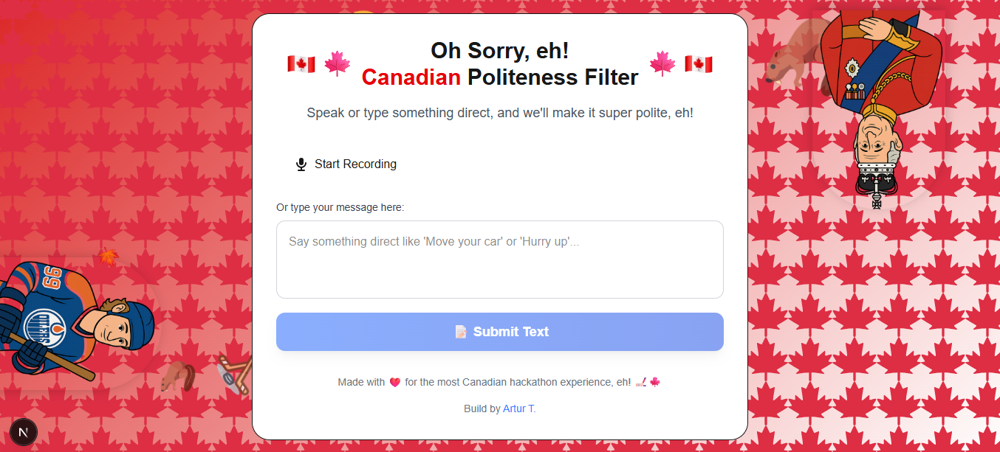

# Oh Sorry! Politeness Filter
Build for Ottawa "Eh I" Summer Vibe Hackathon - one day event.
A delightful Next.js application that transforms direct or rude statements into super polite, Canadian-style speech using AI voice input and text transformation.


## Features

- ** Voice Input**: Record your voice and get instant transcription
- ** AI Transformation**: Convert direct statements into polite Canadian speech
- ** Beautiful UI**: Modern, responsive design with Canadian theming
- ** Text-to-Speech**: Hear your polite version spoken aloud
- ** Copy to Clipboard**: Easy sharing of your polite text

## Application view


##  Tech Stack

- **Frontend**: Next.js 15, React 19, Tailwind CSS
- **Voice Processing**: Web Speech API + OpenAI Whisper
- **AI Text Transformation**: OpenAI GPT-3.5-turbo
- **Styling**: Tailwind CSS with custom Canadian theme

##  Installation

1. **Clone the repository**

   ```bash
   git clone <your-repo-url>
   cd hackathon
   ```

2. **Install dependencies**

   ```bash
   npm install
   ```

3. **Set up environment variables**
   Create a `.env.local` file in the root directory:

   ```env
   OPENAI_API_KEY=your_openai_api_key_here
   ```

   Get your OpenAI API key from [https://platform.openai.com/api-keys](https://platform.openai.com/api-keys)

4. **Run the development server**

   ```bash
   npm run dev
   ```

5. **Open your browser**
   Navigate to [http://localhost:3000](http://localhost:3000)

## How to Use

1. **Voice Input**: Click "Start Recording" and speak your direct statement
2. **Text Input**: Or type your message in the text area
3. **Transform**: Click "🍁 Canadianify It!" to get your polite version
4. **Share**: Copy to clipboard or hear it spoken aloud

## 🍁 Examples

| Direct Statement | Canadian Polite Version                                                               |
| ---------------- | ------------------------------------------------------------------------------------- |
| "Move your car"  | "Hey sorry, could you kindly move your car when you have a moment? Thanks so much!"   |
| "Shut up"        | "Oh sorry, would you mind keeping it down a bit? Thanks kindly, eh!"                  |
| "Hurry up"       | "Hey sorry, could you maybe pick up the pace when you have a chance? Thanks so much!" |


## 🎨 Design Features

- **Canadian Theme**: Red and white color scheme with maple leaf emojis
- **Responsive Design**: Works perfectly on desktop and mobile
- **Smooth Animations**: Loading states and transitions
- **Accessibility**: Proper ARIA labels and keyboard navigation
- **Modern UI**: Clean, professional interface with excellent UX


Made with ❤️ for the most Canadian hackathon experience!🍁
